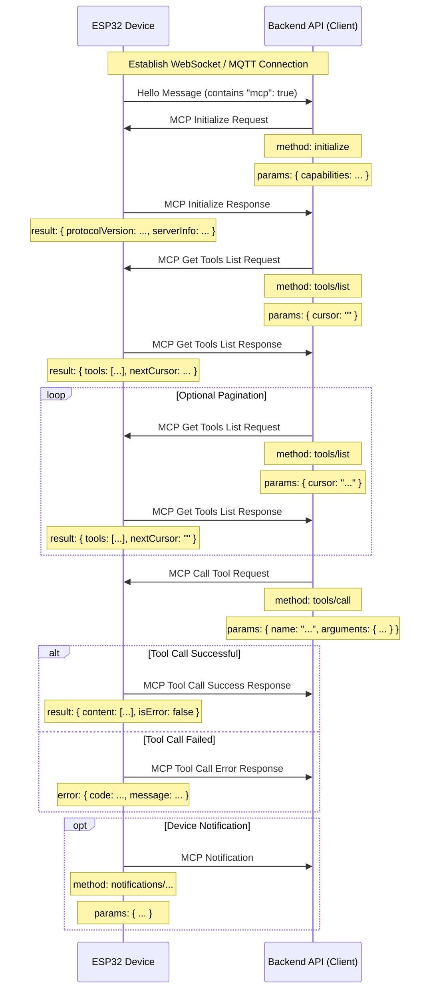

# MCP (Model Context Protocol) Interaction Flow

NOTICE: AI-assisted generation, please refer to the code to confirm details when implementing backend services!!

The MCP protocol in this project is used for communication between the backend API (MCP client) and ESP32 devices (MCP server), enabling the backend to discover and invoke functions (tools) provided by the device.

## Protocol Format

According to the code (`main/protocols/protocol.cc`, `main/mcp_server.cc`), MCP messages are encapsulated within the message body of the base communication protocol (such as WebSocket or MQTT). The internal structure follows the [JSON-RPC 2.0](https://www.jsonrpc.org/specification) specification.

Overall message structure example:

```json
{
  "session_id": "...", // Session ID
  "type": "mcp",       // Message type, fixed as "mcp"
  "payload": {         // JSON-RPC 2.0 payload
    "jsonrpc": "2.0",
    "method": "...",   // Method name (e.g., "initialize", "tools/list", "tools/call")
    "params": { ... }, // Method parameters (for request)
    "id": ...,         // Request ID (for request and response)
    "result": { ... }, // Method execution result (for success response)
    "error": { ... }   // Error information (for error response)
  }
}
```

The `payload` part is a standard JSON-RPC 2.0 message:

- `jsonrpc`: Fixed string "2.0".
- `method`: The method name to call (for Request).
- `params`: Method parameters, a structured value, usually an object (for Request).
- `id`: Request identifier, provided by the client when sending a request, returned as-is by the server in the response. Used to match requests and responses.
- `result`: Result when the method executes successfully (for Success Response).
- `error`: Error information when the method execution fails (for Error Response).

## Interaction Flow and Timing

MCP interactions primarily revolve around the client (backend API) discovering and invoking "tools" on the device.

1.  **Connection Establishment and Capability Advertisement**

    - **Timing:** After the device starts and successfully connects to the backend API.
    - **Sender:** Device.
    - **Message:** The device sends a base protocol "hello" message to the backend API, which includes a list of capabilities the device supports, such as MCP protocol support (`"mcp": true`).
    - **Example (not MCP payload, but base protocol message):**
      ```json
      {
        "type": "hello",
        "version": ...,
        "features": {
          "mcp": true,
          ...
        },
        "transport": "websocket", // or "mqtt"
        "audio_params": { ... },
        "session_id": "..." // May be set after device receives server hello
      }
      ```

2.  **Initialize MCP Session**

    - **Timing:** After the backend API receives the device "hello" message and confirms the device supports MCP, usually sent as the first request of the MCP session.
    - **Sender:** Backend API (client).
    - **Method:** `initialize`
    - **Message (MCP payload):**

      ```json
      {
        "jsonrpc": "2.0",
        "method": "initialize",
        "params": {
          "capabilities": {
            // Client capabilities, optional

            // Camera vision related
            "vision": {
              "url": "...", // Camera: image processing URL (must be HTTP URL, not WebSocket URL)
              "token": "..." // URL token
            }

            // ... other client capabilities
          }
        },
        "id": 1 // Request ID
      }
      ```

    - **Device Response Timing:** After the device receives and processes the `initialize` request.
    - **Device Response Message (MCP payload):**
      ```json
      {
        "jsonrpc": "2.0",
        "id": 1, // Match request ID
        "result": {
          "protocolVersion": "2024-11-05",
          "capabilities": {
            "tools": {} // tools here doesn't list detailed information, need tools/list
          },
          "serverInfo": {
            "name": "...", // Device name (BOARD_NAME)
            "version": "..." // Device firmware version
          }
        }
      }
      ```

3.  **Discover Device Tool List**

    - **Timing:** When the backend API needs to obtain the specific list of functions (tools) currently supported by the device and how to invoke them.
    - **Sender:** Backend API (client).
    - **Method:** `tools/list`
    - **Message (MCP payload):**
      ```json
      {
        "jsonrpc": "2.0",
        "method": "tools/list",
        "params": {
          "cursor": "" // For pagination, empty string for first request
        },
        "id": 2 // Request ID
      }
      ```
    - **Device Response Timing:** After the device receives the `tools/list` request and generates the tool list.
    - **Device Response Message (MCP payload):**
      ```json
      {
        "jsonrpc": "2.0",
        "id": 2, // Match request ID
        "result": {
          "tools": [ // List of tool objects
            {
              "name": "self.get_device_status",
              "description": "...",
              "inputSchema": { ... } // Parameter schema
            },
            {
              "name": "self.audio_speaker.set_volume",
              "description": "...",
              "inputSchema": { ... } // Parameter schema
            }
            // ... more tools
          ],
          "nextCursor": "..." // If the list is large and needs pagination, this will contain the cursor value for the next request
        }
      }
      ```
    - **Pagination Handling:** If the `nextCursor` field is non-empty, the client needs to send another `tools/list` request with this `cursor` value in `params` to get the next page of tools.

4.  **Invoke Device Tool**

    - **Timing:** When the backend API needs to execute a specific function on the device.
    - **Sender:** Backend API (client).
    - **Method:** `tools/call`
    - **Message (MCP payload):**
      ```json
      {
        "jsonrpc": "2.0",
        "method": "tools/call",
        "params": {
          "name": "self.audio_speaker.set_volume", // Tool name to invoke
          "arguments": {
            // Tool parameters, object format
            "volume": 50 // Parameter name and its value
          }
        },
        "id": 3 // Request ID
      }
      ```
    - **Device Response Timing:** After the device receives the `tools/call` request and executes the corresponding tool function.
    - **Device Success Response Message (MCP payload):**
      ```json
      {
        "jsonrpc": "2.0",
        "id": 3, // Match request ID
        "result": {
          "content": [
            // Tool execution result content
            { "type": "text", "text": "true" } // Example: set_volume returns bool
          ],
          "isError": false // Indicates success
        }
      }
      ```
    - **Device Failure Response Message (MCP payload):**
      ```json
      {
        "jsonrpc": "2.0",
        "id": 3, // Match request ID
        "error": {
          "code": -32601, // JSON-RPC error code, e.g., Method not found (-32601)
          "message": "Unknown tool: self.non_existent_tool" // Error description
        }
      }
      ```

5.  **Device Active Message Sending (Notifications)**
    - **Timing:** When events occur within the device that need to notify the backend API (e.g., state changes, although the code examples don't explicitly show tools sending such messages, the existence of `Application::SendMcpMessage` suggests the device may actively send MCP messages).
    - **Sender:** Device (server).
    - **Method:** May be a method name starting with `notifications/`, or other custom methods.
    - **Message (MCP payload):** Follows JSON-RPC Notification format, without `id` field.
      ```json
      {
        "jsonrpc": "2.0",
        "method": "notifications/state_changed", // Example method name
        "params": {
          "newState": "idle",
          "oldState": "connecting"
        }
        // No id field
      }
      ```
    - **Backend API Handling:** After receiving a Notification, the backend API processes it accordingly but does not reply.

## Interaction Diagram

Below is a simplified interaction sequence diagram showing the main MCP message flow:



This document outlines the main interaction flow of the MCP protocol in this project. For specific parameter details and tool functionality, please refer to `McpServer::AddCommonTools` in `main/mcp_server.cc` and the implementation of each tool.


