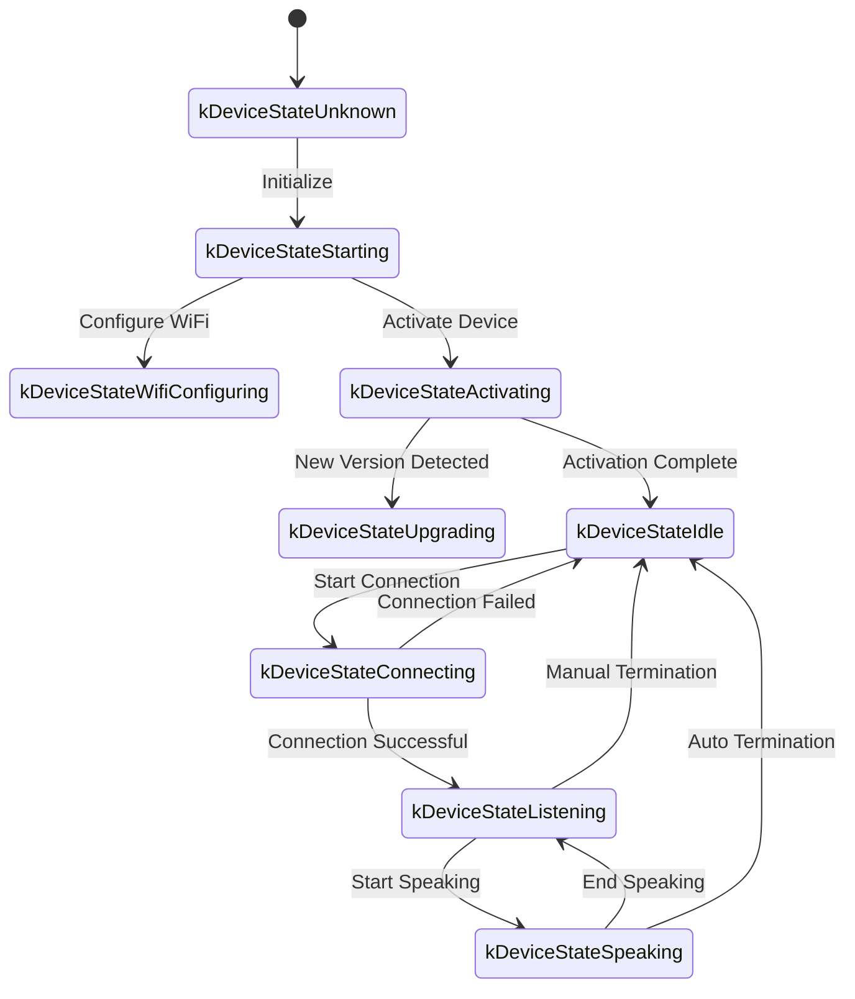
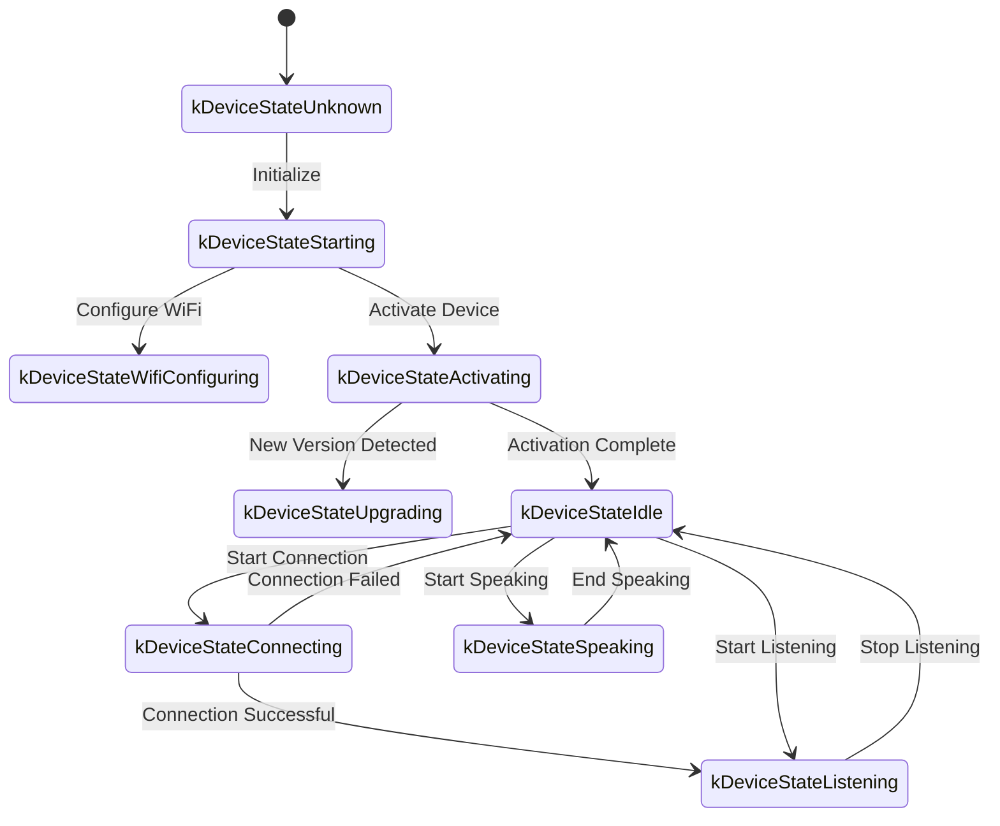

The following is a WebSocket communication protocol document organized based on code implementation, outlining how the device and server interact via WebSocket.

This document is inferred only from the provided code. For actual deployment, it may need to be further confirmed or supplemented in combination with the server-side implementation.

---

## 1. Overall Flow Overview

1. **Device Initialization**  
   - Device powers on and initializes `Application`:  
     - Initialize audio codec, display, LED, etc.  
     - Connect to network  
     - Create and initialize a WebSocket protocol instance (`WebsocketProtocol`) that implements the `Protocol` interface  
   - Enter main loop waiting for events (audio input, audio output, scheduled tasks, etc.).

2. **Establish WebSocket Connection**  
   - When the device needs to start a voice session (e.g., user wake-up, manual button trigger, etc.), call `OpenAudioChannel()`:  
     - Get WebSocket URL based on configuration
     - Set several request headers (`Authorization`, `Protocol-Version`, `Device-Id`, `Client-Id`)  
     - Call `Connect()` to establish WebSocket connection with server  

3. **Device Sends "hello" Message**  
   - After successful connection, the device sends a JSON message with the following example structure:  
   ```json
   {
     "type": "hello",
     "version": 1,
     "features": {
       "mcp": true
     },
     "transport": "websocket",
     "audio_params": {
       "format": "opus",
       "sample_rate": 16000,
       "channels": 1,
       "frame_duration": 60
     }
   }
   ```
   - The `features` field is optional, and its content is automatically generated based on device compilation configuration. For example: `"mcp": true` indicates MCP protocol support.
   - The value of `frame_duration` corresponds to `OPUS_FRAME_DURATION_MS` (e.g., 60ms).

4. **Server Replies "hello"**  
   - The device waits for the server to return a JSON message containing `"type": "hello"` and checks if `"transport": "websocket"` matches.  
   - The server may optionally send a `session_id` field, which the device will automatically record upon receipt.  
   - Example:
   ```json
   {
     "type": "hello",
     "transport": "websocket",
     "session_id": "xxx",
     "audio_params": {
       "format": "opus",
       "sample_rate": 24000,
       "channels": 1,
       "frame_duration": 60
     }
   }
   ```
   - If it matches, the device considers the server ready and marks the audio channel as successfully opened.  
   - If no correct reply is received within the timeout period (default 10 seconds), the connection is considered failed and triggers a network error callback.

5. **Subsequent Message Interaction**  
   - Two main types of data can be sent between the device and server:  
     1. **Binary audio data** (Opus encoded)  
     2. **Text JSON messages** (for transmitting chat state, TTS/STT events, MCP protocol messages, etc.)  

   - In the code, receive callbacks are mainly divided into:  
     - `OnData(...)`:  
       - When `binary` is `true`, it is considered an audio frame; the device will decode it as Opus data.  
       - When `binary` is `false`, it is considered JSON text, which needs to be parsed with cJSON on the device side and processed with corresponding business logic (such as chat, TTS, MCP protocol messages, etc.).  

   - When the server or network disconnects, the `OnDisconnected()` callback is triggered:  
     - The device will call `on_audio_channel_closed_()` and eventually return to idle state.

6. **Close WebSocket Connection**  
   - When the device needs to end a voice session, it calls `CloseAudioChannel()` to actively disconnect and return to idle state.  
   - Or if the server actively disconnects, it will trigger the same callback flow.

---

## 2. Common Request Headers

When establishing a WebSocket connection, the code example sets the following request headers:

- `Authorization`: Used to store access token, in the form of `"Bearer <token>"`  
- `Protocol-Version`: Protocol version number, consistent with the `version` field in the hello message body  
- `Device-Id`: Device physical network interface MAC address
- `Client-Id`: Software-generated UUID (will be reset when NVS is erased or firmware is reflashed)

These headers are sent to the server along with the WebSocket handshake, and the server can perform validation, authentication, etc., as needed.

---

## 3. Binary Protocol Versions

The device supports multiple binary protocol versions, specified via the `version` field in the configuration:

### 3.1 Version 1 (Default)
Directly sends Opus audio data without additional metadata. The WebSocket protocol distinguishes between text and binary.

### 3.2 Version 2
Uses `BinaryProtocol2` structure:
```c
struct BinaryProtocol2 {
    uint16_t version;        // Protocol version
    uint16_t type;           // Message type (0: OPUS, 1: JSON)
    uint32_t reserved;       // Reserved field
    uint32_t timestamp;      // Timestamp (milliseconds, for server-side AEC)
    uint32_t payload_size;   // Payload size (bytes)
    uint8_t payload[];       // Payload data
} __attribute__((packed));
```

### 3.3 Version 3
Uses `BinaryProtocol3` structure:
```c
struct BinaryProtocol3 {
    uint8_t type;            // Message type
    uint8_t reserved;        // Reserved field
    uint16_t payload_size;   // Payload size
    uint8_t payload[];       // Payload data
} __attribute__((packed));
```

---

## 4. JSON Message Structure

WebSocket text frames are transmitted in JSON format. The following are common `"type"` fields and their corresponding business logic. If a message contains fields not listed, they may be optional or specific implementation details.

### 4.1 Device → Server

1. **Hello**  
   - Sent by the device after successful connection to inform the server of basic parameters.  
   - Example:
     ```json
     {
       "type": "hello",
       "version": 1,
       "features": {
         "mcp": true
       },
       "transport": "websocket",
       "audio_params": {
         "format": "opus",
         "sample_rate": 16000,
         "channels": 1,
         "frame_duration": 60
       }
     }
     ```

2. **Listen**  
   - Indicates the device starts or stops recording/listening.  
   - Common fields:  
     - `"session_id"`: Session identifier  
     - `"type": "listen"`  
     - `"state"`: `"start"`, `"stop"`, `"detect"` (wake word detection triggered)  
     - `"mode"`: `"auto"`, `"manual"` or `"realtime"`, indicating recognition mode.  
   - Example: Start listening  
     ```json
     {
       "session_id": "xxx",
       "type": "listen",
       "state": "start",
       "mode": "manual"
     }
     ```

3. **Abort**  
   - Terminates current speech (TTS playback) or voice channel.  
   - Example:
     ```json
     {
       "session_id": "xxx",
       "type": "abort",
       "reason": "wake_word_detected"
     }
     ```
   - `reason` value can be `"wake_word_detected"` or others.

4. **Wake Word Detected**  
   - Used by the device to inform the server that a wake word has been detected.
   - Before sending this message, Opus audio data of the wake word can be sent in advance for server-side speaker recognition.  
   - Example:
     ```json
     {
       "session_id": "xxx",
       "type": "listen",
       "state": "detect",
       "text": "你好小明"
     }
     ```

5. **MCP**
   - Recommended new-generation protocol for IoT control. All device capability discovery, tool invocation, etc., are performed through messages with type: "mcp", with the payload being standard JSON-RPC 2.0 (see [MCP Protocol Documentation](./mcp-protocol-en.md) for details).
   
   - **Example of device sending result to server:**
     ```json
     {
       "session_id": "xxx",
       "type": "mcp",
       "payload": {
         "jsonrpc": "2.0",
         "id": 1,
         "result": {
           "content": [
             { "type": "text", "text": "true" }
           ],
           "isError": false
         }
       }
     }
     ```

---

### 4.2 Server → Device

1. **Hello**  
   - Handshake confirmation message returned by the server.  
   - Must contain `"type": "hello"` and `"transport": "websocket"`.  
   - May include `audio_params`, indicating the audio parameters expected by the server or configuration aligned with the device.   
   - The server may optionally send a `session_id` field, which the device will automatically record upon receipt.  
   - After successful receipt, the device sets an event flag indicating the WebSocket channel is ready.

2. **STT**  
   - `{"session_id": "xxx", "type": "stt", "text": "..."}`
   - Indicates the server has recognized user speech. (e.g., speech-to-text result)  
   - The device may display this text on the screen, then proceed to response and other flows.

3. **LLM**  
   - `{"session_id": "xxx", "type": "llm", "emotion": "happy", "text": "😀"}`
   - Server instructs the device to adjust emoji animation / UI expression.  

4. **TTS**  
   - `{"session_id": "xxx", "type": "tts", "state": "start"}`: Server is ready to send TTS audio, device enters "speaking" playback state.  
   - `{"session_id": "xxx", "type": "tts", "state": "stop"}`: Indicates this TTS session has ended.  
   - `{"session_id": "xxx", "type": "tts", "state": "sentence_start", "text": "..."}`
     - Allows the device to display the current text fragment to be played or read on the interface (e.g., for display to the user).  

5. **MCP**
   - The server sends IoT-related control commands or returns invocation results through messages with type: "mcp", with the same payload structure as above.
   
   - **Example of server sending tools/call to device:**
     ```json
     {
       "session_id": "xxx",
       "type": "mcp",
       "payload": {
         "jsonrpc": "2.0",
         "method": "tools/call",
         "params": {
           "name": "self.light.set_rgb",
           "arguments": { "r": 255, "g": 0, "b": 0 }
         },
         "id": 1
       }
     }
     ```

6. **System**
   - System control commands, commonly used for remote upgrade updates.
   - Example:
     ```json
     {
       "session_id": "xxx",
       "type": "system",
       "command": "reboot"
     }
     ```
   - Supported commands:
     - `"reboot"`: Reboot device

7. **Custom** (Optional)
   - Custom messages, supported when `CONFIG_RECEIVE_CUSTOM_MESSAGE` is enabled.
   - Example:
     ```json
     {
       "session_id": "xxx",
       "type": "custom",
       "payload": {
         "message": "Custom content"
       }
     }
     ```

8. **Audio Data: Binary Frames**  
   - When the server sends audio binary frames (Opus encoded), the device decodes and plays them.  
   - If the device is in "listening" (recording) state, received audio frames will be ignored or cleared to prevent conflicts.

---

## 5. Audio Codec

1. **Device Sends Recording Data**  
   - Audio input, after possible echo cancellation, noise reduction, or volume gain, is encoded with Opus and packaged as binary frames sent to the server.  
   - Depending on the protocol version, Opus data may be sent directly (version 1) or using a binary protocol with metadata (version 2/3).

2. **Device Plays Received Audio**  
   - When receiving binary frames from the server, they are also considered Opus data.  
   - The device will decode them and then play through the audio output interface.  
   - If the server's audio sample rate differs from the device, resampling will be performed after decoding.

---

## 6. Common State Transitions

The following are common key state transitions on the device side, corresponding to WebSocket messages:

1. **Idle** → **Connecting**  
   - After user trigger or wake-up, device calls `OpenAudioChannel()` → establishes WebSocket connection → sends `"type":"hello"`.  

2. **Connecting** → **Listening**  
   - After successful connection, if `SendStartListening(...)` continues to execute, it enters recording state. The device will continuously encode microphone data and send it to the server.  

3. **Listening** → **Speaking**  
   - Receives server TTS Start message (`{"type":"tts","state":"start"}`) → stops recording and plays received audio.  

4. **Speaking** → **Idle**  
   - Server TTS Stop (`{"type":"tts","state":"stop"}`) → audio playback ends. If auto-listening is not continued, returns to Idle; if auto-loop is configured, enters Listening again.  

5. **Listening** / **Speaking** → **Idle** (on exception or active interruption)  
   - Call `SendAbortSpeaking(...)` or `CloseAudioChannel()` → interrupts session → closes WebSocket → state returns to Idle.  

### Auto Mode State Transition Diagram



### Manual Mode State Transition Diagram



---

## 7. Error Handling

1. **Connection Failure**  
   - If `Connect(url)` returns failure or times out while waiting for server "hello" message, triggers `on_network_error_()` callback. The device will display "Unable to connect to service" or similar error message.

2. **Server Disconnection**  
   - If WebSocket abnormally disconnects, callback `OnDisconnected()`:  
     - Device calls `on_audio_channel_closed_()`  
     - Switches to Idle or other retry logic.

---

## 8. Other Notes

1. **Authentication**  
   - The device provides authentication by setting `Authorization: Bearer <token>`, and the server needs to verify if it is valid.  
   - If the token expires or is invalid, the server can reject the handshake or disconnect later.

2. **Session Control**  
   - Some messages in the code contain `session_id` to distinguish independent conversations or operations. The server can handle different sessions separately as needed.

3. **Audio Payload**  
   - The code defaults to Opus format with `sample_rate = 16000`, mono channel. Frame duration is controlled by `OPUS_FRAME_DURATION_MS`, generally 60ms. Can be adjusted appropriately based on bandwidth or performance. For better music playback, server downlink audio may use 24000 sample rate.

4. **Protocol Version Configuration**  
   - Configure binary protocol version (1, 2, or 3) via the `version` field in settings
   - Version 1: Directly send Opus data
   - Version 2: Use binary protocol with timestamp, suitable for server-side AEC
   - Version 3: Use simplified binary protocol

5. **MCP Protocol Recommended for IoT Control**  
   - Device capability discovery, state synchronization, control commands, etc., between device and server should all be implemented through MCP protocol (type: "mcp"). The original type: "iot" solution is deprecated.
   - MCP protocol can be transmitted over WebSocket, MQTT, and other underlying protocols, providing better extensibility and standardization capabilities.
   - For detailed usage, please refer to [MCP Protocol Documentation](./mcp-protocol-en.md) and [MCP IoT Control Usage](./mcp-usage-en.md).

6. **Error or Invalid JSON**  
   - When JSON is missing required fields, such as `{"type": ...}`, the device will log an error (`ESP_LOGE(TAG, "Missing message type, data: %s", data);`) and will not execute any business logic.

---

## 9. Message Examples

Below is a typical bidirectional message example (simplified flow illustration):

1. **Device → Server** (Handshake)
   ```json
   {
     "type": "hello",
     "version": 1,
     "features": {
       "mcp": true
     },
     "transport": "websocket",
     "audio_params": {
       "format": "opus",
       "sample_rate": 16000,
       "channels": 1,
       "frame_duration": 60
     }
   }
   ```

2. **Server → Device** (Handshake Response)
   ```json
   {
     "type": "hello",
     "transport": "websocket",
     "session_id": "xxx",
     "audio_params": {
       "format": "opus",
       "sample_rate": 16000
     }
   }
   ```

3. **Device → Server** (Start Listening)
   ```json
   {
     "session_id": "xxx",
     "type": "listen",
     "state": "start",
     "mode": "auto"
   }
   ```
   Meanwhile, the device starts sending binary frames (Opus data).

4. **Server → Device** (ASR Result)
   ```json
   {
     "session_id": "xxx",
     "type": "stt",
     "text": "User's speech"
   }
   ```

5. **Server → Device** (TTS Start)
   ```json
   {
     "session_id": "xxx",
     "type": "tts",
     "state": "start"
   }
   ```
   Then the server sends binary audio frames to the device for playback.

6. **Server → Device** (TTS Stop)
   ```json
   {
     "session_id": "xxx",
     "type": "tts",
     "state": "stop"
   }
   ```
   The device stops playing audio. If there are no more instructions, it returns to idle state.

---

## 10. Summary

This protocol completes functions including audio stream upload, TTS audio playback, speech recognition and state management, MCP command delivery, etc., by transmitting JSON text and binary audio frames over WebSocket. Its core features:

- **Handshake Phase**: Send `"type":"hello"`, wait for server response.  
- **Audio Channel**: Bidirectional transmission of voice streams using Opus-encoded binary frames, supporting multiple protocol versions.  
- **JSON Messages**: Use `"type"` as the core field to identify different business logic, including TTS, STT, MCP, WakeWord, System, Custom, etc.  
- **Extensibility**: Can add fields to JSON messages as needed, or perform additional authentication in headers.

The server and device need to agree in advance on the field meanings, timing logic, and error handling rules for various messages to ensure smooth communication. The above information can serve as a basic document for subsequent integration, development, or extension.

